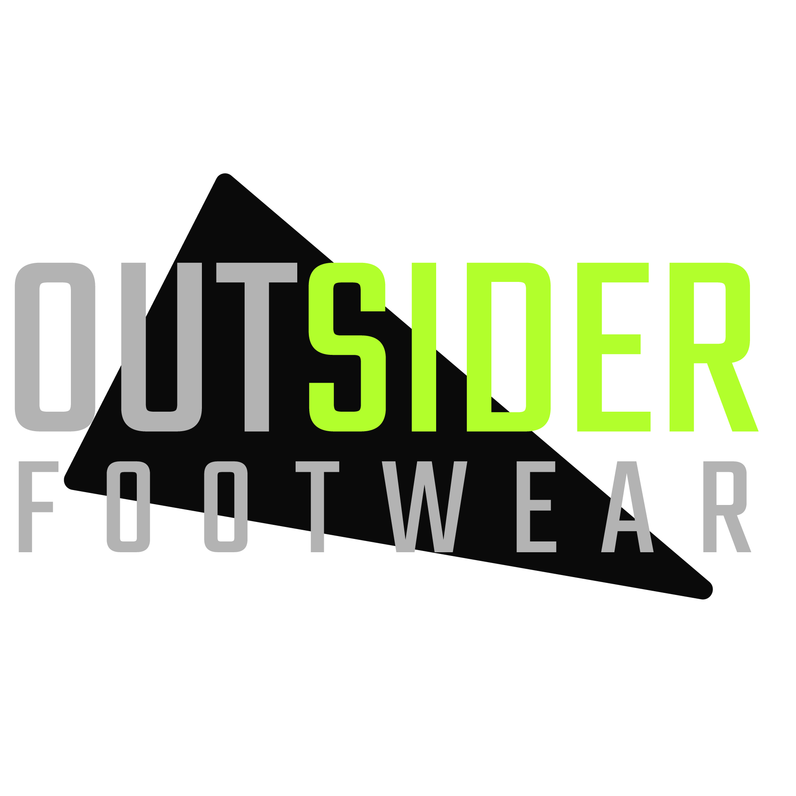

# SCC0219 Web Development - 2° Semestre 2021
Projeto dedicado para disciplina de Web Development do ICMC, USP São Carlos

### Grupo 4
Matheus Vinicius Gouvea de Godoi  - 10295217 
Hugo de Azevedo Vitulli           - 10295221 
Henrique Hiram Libutti Núñez      - 11275300

---

# Table of Contents
1. [Description](#description)
2. [Project Report](#project-report)

# Outsider Footwear - Grupo 4

## Description

Outsider Footwear é um website de e-commerce com objetivo de venda de calçados. 
Planejamos desenvolver a jornada de um usuário desde o cadastro até a compra de um produto do site, e também as funcionalidades de um administrador do sistema.

## Project Report

Link para o relatório do projeto: [Project Report PDF](.//Project%20Report%20-%20Outsider%20Footwear.pdf) ou [Project Report Drive](https://docs.google.com/document/d/1yoO7F3VvTQwwP1Ou5hAVRDKiY5JLPLHwN-URF7ywvEs) 
Link para o Mockup: [Mockup](https://www.figma.com/file/yU54ILUCOEfFzRD69cfnD3/Outsider-Footwear?node-id=12918%3A2) 
Link para o Diagrama de Navegação: [Navigation Diagram](https://www.figma.com/proto/yU54ILUCOEfFzRD69cfnD3/Outsider-Footwear?node-id=12918%3A24&scaling=min-zoom&page-id=12918%3A2&starting-point-node-id=12918%3A24) 
